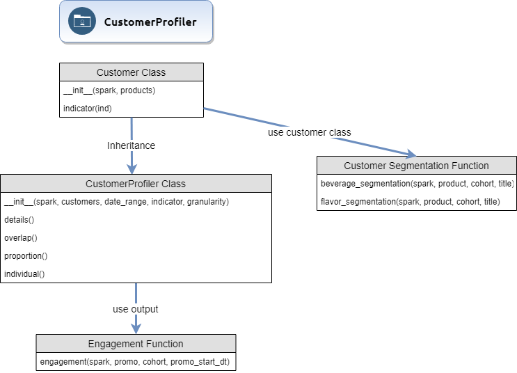

# Databricks Functions

This package includes functions for python and pyspark that are used in databricks.

## Dependencies

 - Spark 2.4. 
 - A recent version of pandas. 
 - Python 3.5+.

## Getting Started

`fkwan` is available at the [Github](https://github.com/kwanern/fkwan), for databricks
```
/databricks/python/bin/pip install git+https://github.com/kwanern/fkwan.git
cd /databricks/python3/lib/python3.5/site-packages
git clone https://github.com/kwanern/fkwan.git
```

After installing the packages, you can import the package:
```
import fkwan
```
Customer Profiler Packages:



## Versioning

Version 1.3.2

## Authors

* **Fu Ern Kwan** - *Initial work*

